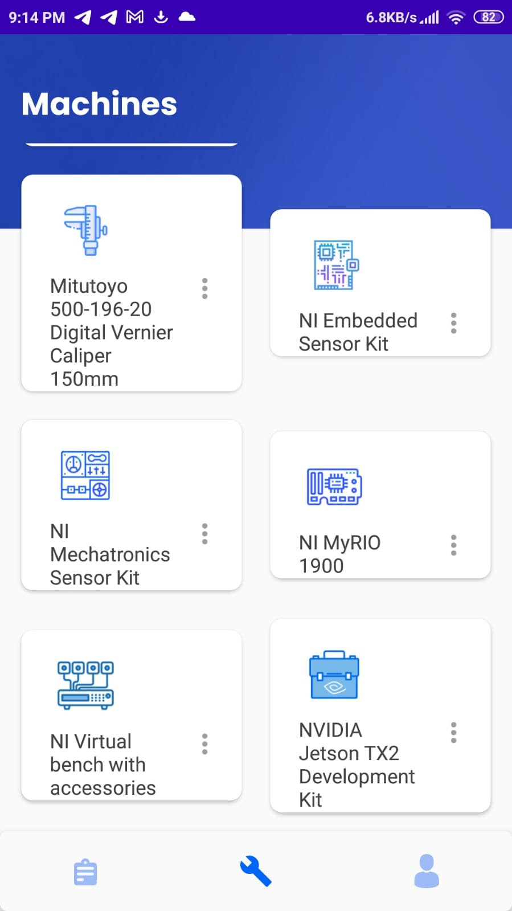

# Rotor- Android App

Rotor App simplifies machine scheduling. With Rotor, you can easily check machine availability and book them for your use. Users can reserve a machine for up to 10 consecutive days

This application was originally created by Team Tessera.

## Features

- Do machine reservations with ease
- All bookings section gives info about ongoing bookings
- Scalable with flexible firebase backend
- Possibility to cache images locally for offline reading.
- Dedicated profile section managing user info
- End booking anytime with ease
- All bookings monitored and managed with the Rotor admin app

## Screenshots

